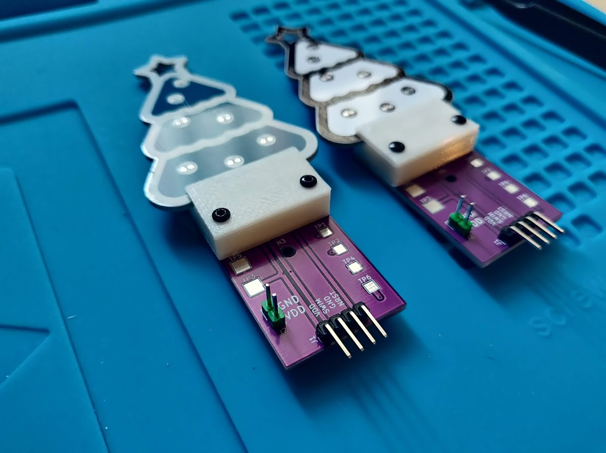

# Xmas 2021 prog adapter

This jig is aimed to simplify the programming process on a large number of pieces.
It is possible to flash (and debug) a PCB in the matter of seconds, just slide in
the tree!

The 3D model is relized with [SolveSpace](https://solvespace.com/index.pl).

It is possible to use the voltage reference from the tree battery holder or use
an external PSU through the various header/test points. The programming probe
connects to J1.
